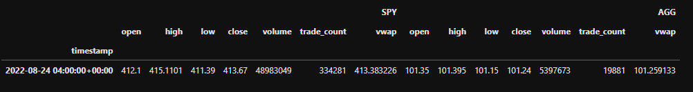
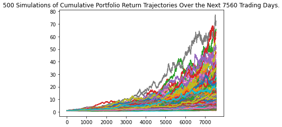
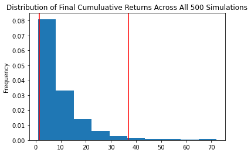
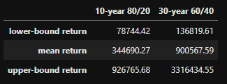
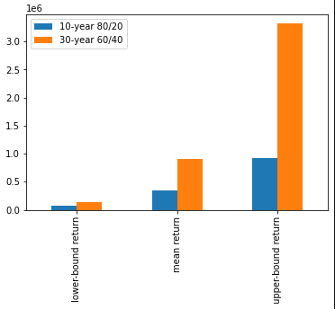

# Financial Planning with APIs and Simulations

## Overview and Purpose
This project consists of two financial analysis tools to help people become more prepared for the future.

The first part of the project is a tool that uses current pricing data to determine if a credit union member's current investments are enough to cover a potential emergency. The second part is a series of simulations and calculations to help the member plan for retirement. Both of these tools use APIs in order to retrieve the most current data to assess. For cryptocurrency pricing data, I used [Free Crypto API](https://alternative.me/crypto/api/) with the Python Requests library. For stock and bond data, I used [Alpaca API](https://alpaca.markets/) with the Alpaca SDK.

The purpose of this project is to demonstrate use of APIs to collect up-to-date financial data, as well as use of Monte Carlo simulations and statistical analysis to make predictions and recommendations. It is the weekly challenge for Module 5 of the UW Fintech Boot Camp, Financial Simulations and APIs.

---

## Emergency Financial Planner
It is important to have money saved in case of an emergency. This tool analyzes a portfolio made up of cryptocurrencies, stocks, and bonds to determine if the value of all of the assets combined is enough to cover at least 3 months of potential lost income for the user.

### Data Collection - Cryptocurrency
After assigning the Free Crypto API endpoint URLs to variables, I used the Python Requests library to request the data and convert it to a JSON object. The following code shows the request for the Bitcoin data:

`btc_response = requests.get(btc_url).json()`

Printing the JSON object:

`print(json.dumps(btc_response, indent=4, sort_keys=True))`

```
{
    "data": {
        "1": {
            "circulating_supply": 19132175,
            "id": 1,
            "last_updated": 1661479452,
            "max_supply": 21000000,
            "name": "Bitcoin",
            "quotes": {
                "USD": {
                    "market_cap": 412285467880,
                    "percent_change_1h": 0.108112096463858,
                    "percent_change_24h": -0.156703908402737,
                    "percent_change_7d": -7.2854761473299,
                    "percentage_change_1h": 0.108112096463858,
                    "percentage_change_24h": -0.156703908402737,
                    "percentage_change_7d": -7.2854761473299,
                    "price": 21555.0,
                    "volume_24h": 26954221766
                }
            },
            "rank": 1,
            "symbol": "BTC",
            "total_supply": 19132175,
            "website_slug": "bitcoin"
        }
    },
    "metadata": {
        "error": null,
        "num_cryptocurrencies": 3116,
        "timestamp": 1661479452
    }
}
```

After converting the data to JSON objects, I then assigned the current price for each coin to a variable:

```
btc_price = btc_response['data']['1']['quotes']['USD']['price']
eth_price = eth_response['data']['1027']['quotes']['USD']['price']
```

Finally, I calculated the total value of the member's cryptocurrency wallet:

```
btc_value = btc_price * btc_coins
eth_value = eth_price * eth_coins
total_crypto_wallet = btc_value + eth_value
```

### Data Collection - Stocks and Bonds
Since the Alpaca API has its own SDK, the process of getting the stock and bond data was a bit more streamlined. After pulling my API credentials from a .env file and assigning them to variables, I then created an Alpaca REST object:

```
alpaca_api_key = os.getenv('alpaca_api_key')
alpaca_secret_key = os.getenv('alpaca_secret_key')

alpaca = tradeapi.REST(
    alpaca_api_key,
    alpaca_secret_key,
    api_version='v2')
```

I then used the following code to assign the data to a DataFrame. For this section, I only pulled data for one day, since the purpose is to calculate the current value of the portfolio.

```
tickers = ['SPY', 'AGG']
timeframe = '1Day'
start_date = pd.Timestamp('2022-08-24', tz='America/New_York').isoformat()
end_date = pd.Timestamp('2022-08-24', tz='America/New_York').isoformat()

prices_df = alpaca.get_bars(
    tickers,
    timeframe,
    start=start_date,
    end=end_date
).df

SPY = prices_df[prices_df['symbol']=='SPY'].drop('symbol', axis=1)
AGG = prices_df[prices_df['symbol']=='AGG'].drop('symbol', axis=1)

prices_df = pd.concat([SPY, AGG], axis=1, keys=['SPY', 'AGG'])
```



Now that we have the data, we can repeat the process used earlier with the cryptocurrency wallet to find the total value of the member's stock/bond portfolio.

### Evaluating the Emergency Fund
Using the total portfolio value including cryptocurrencies, stocks, and bonds, the next step is to evaluate if the value of the portfolio is sufficient for an emergency fund. For the purpose of this project, as sufficient amount for an emergency fund is three times the member's monthly income. We can make this evaluation by passing our vairables into an `if` statement:

```
if total_portfolio > emergency_fund_value:
    print('Congratulations! You have enough money in your emergency fund!')
elif total_portfolio == emergency_fund_value:
    print('Congratulations on reaching the goal of creating an emergency fund!')
else:
    print(f'You need {emergency_fund_value - total_portfolio} more dollars to reach your goal.')
```

---

## Financial Planner for Retirement
Deciding when to retire is a significant life decision. As such, it is important to start planning for retirement early. This tool allows the member to simulate possible outcomes of different retirement portfolios over various time periods in order to determine when it would be possible to retire.

For this tool I used the Alpaca API to collect three years of historical data for each stock and bond in the member's portfolio. This data will be the basis for the two Monte Carlo simulations.

The first simulation is a 30-year forecast made up of 500 possible outcomes with a 60% weight in stocks and a 40% weight in bonds. The following code configures and runs the simulation:

```
MC_30_year = MCSimulation(
    portfolio_data = prices_3_year,
    weights = [.6,.4],
    num_simulation = 500,
    num_trading_days = 252*30)

MC_30_year.calc_cumulative_return()
```

We can visualize this forecast with a line plot and a histogram:





I followed the same process for the second simulation, a 10-year forecast made up of 500 possible outcomes with an 80% weight in stocks and a 20% weight in bonds. 

### Analyzing and Comparing the Portfolio Forecasts
The final section of the project consists of using statistical analysis of the two simulations to determine if either would be a realistic plan for retirement. To do this, I generated summary statistics for each simulation, and used a 95% confidence interval to calculate a realistic range of possible outcomes. To calculate the starting value for each portfolio, I used the 310 total shares that the member had and adjusted the number of shares for each asset to reflect their corresponding distributions, as shown in the following code for the 30-year-forecast:

```
MC_30_summary_statistics = MC_30_year.summarize_cumulative_return()

count           500.000000
mean             10.062615
std               9.544216
min               0.938664
25%               4.108190
50%               7.061660
75%              12.708261
max              72.062094
95% CI Lower      1.528773
95% CI Upper     37.056633
Name: 7560, dtype: float64

total_shares = 310
spy_shares_30 = total_shares * .6
agg_shares_30 = total_shares * .4
spy_value_30 = float(spy_shares_30 * spy_close_price)
agg_value_30 = float(agg_shares_30 * agg_close_price)
total_30_portfolio_value = spy_value_30 + agg_value_30
total_30_portfolio_value

ci_lower_30_cumulative_return = MC_30_summary_statistics[8] * total_30_portfolio_value
ci_upper_30_cumulative_return = MC_30_summary_statistics[9] * total_30_portfolio_value
```

To get a clearer picture of the differences between the forecasts, I decided to put the upper-bound, lower-bound, and mean forecasted total returns into a DataFrame and visualize it with a bar chart.





## Conclusion
For this project, we were asked to answer the question: will weighting the portfolio more heavily to stocks allow the credit union members to retire after only 10 years?

Note: The figures I mention in this section are from one iteration of the two simulations. Running the simulations again could result in slightly different numbers, but the conclusions remain the same.

While it would be theoretically possible for the credit union members to be able to retire after only ten years, it would be much more risky. While weighting the portfolio more heavily on stocks could possibly yield a 926,765.68 dollars over ten years, that figure is at the upper range of the confidence interval, and therefore could be seen as a best case scenario. Another factor to consider is that the earlier one retires, the longer they are going to have to stretch the money from their retirement portfolio.

Suppose the member is 35 years old. If they retire in 10 years at age 45, and we expect them to live to age 85, they will need that money to last for 40 years, assuming that they will not go back to work. With a mean return of 344,690.27 dollars, that would allow them only 8,617 dollars per year, which is obviously not enough. Even in the best case scenario of making 926,765 dollars, that would still only allow them 23,169 dollars per year. On the other hand, if the member is currently 55 years old and they want to retire in 10 years at age 65, and they expect to live to 85, that would give them a mean 17,234 dollars per year, still not enough, or a best case scenario of 46,338 dollars per year, which while theoretically livable, is still not ideal. Unfortunately, the 55 year old customer is most likely not going to want to retire at age 85, so their options would be more limited than the 35 year old customer.

These findings have emphasized even further to me the importance of planning for retirement early. Additionally, it also demonstrates the importance of having a larger, more diversified portfolio. If all of your investments are distributed between only one stock and one bond, then your options will be much more limited than someone whose assets are distributed amongst several stocks, bonds, real-estate holdings, etc.

In this scenario, I would not advise the credit union members to plan on being able to retire in 10 years. A slightly extended window, such as 15 or 20 years, could be more realistic.

Finally, we also need to take the results of both of these simulations with a sizeable sprinkle of salt, as both simulations are projecting significantly further into the future than the data they are based on. I do not think it would be responsible to present a simulation of 10 to 30 years of returns based on only 3 years of historical data as an accurate prediction. To create a prediction that I would be fully confident presenting to customers in a professional setting, I would have to rerun the 10 and 30 year simulations using at least 10 and 30 years of historical data, respectively. Also I believe the summary statistics of the simulations would be more accurate if at least 1000 simulations were run instead of 500.

---

## Technologies

* Jupyter Lab and Jupyter Notebooks
* Python 3.9
* Python packages: OS, JSON, Requests, Pandas,  Dotenv, Alpaca Trade API
* Monte Carlo Simulation

An Alpaca API key and secret key are required in order to import data for use in this project.

---

## Contributors
Lydia Ciummo - lydiaciummo@hotmail.com

---

## License
GNU General Public License v3.0